ECO 395 Homework 4: Taylor Neal
================

## 1) Clustering and PCA

In this exercise, we will run both PCA and K-means++ clustering on the
11 chemical properties (scaled and centered) for the provided wine data.
Our goal is to determine whether either of these unsupervised learning
techniques easily distinguish between red and white wines (and further
to see if these unsupervised techniques can distinguish between high and
low quality wines). We will begin by briefly examining the PCA results,
but (in the interest of relative ease of interpretation) clustering
results will be our primary focus.

|                      |   PC1 |   PC2 |   PC3 |   PC4 |   PC5 |
|:---------------------|------:|------:|------:|------:|------:|
| fixed.acidity        | -0.24 |  0.34 | -0.43 |  0.16 | -0.15 |
| volatile.acidity     | -0.38 |  0.12 |  0.31 |  0.21 |  0.15 |
| citric.acid          |  0.15 |  0.18 | -0.59 | -0.26 | -0.16 |
| residual.sugar       |  0.35 |  0.33 |  0.16 |  0.17 | -0.35 |
| chlorides            | -0.29 |  0.32 |  0.02 | -0.24 |  0.61 |
| free.sulfur.dioxide  |  0.43 |  0.07 |  0.13 | -0.36 |  0.22 |
| total.sulfur.dioxide |  0.49 |  0.09 |  0.11 | -0.21 |  0.16 |
| density              | -0.04 |  0.58 |  0.18 |  0.07 | -0.31 |
| pH                   | -0.22 | -0.16 |  0.46 | -0.41 | -0.45 |
| sulphates            | -0.29 |  0.19 | -0.07 | -0.64 | -0.14 |
| alcohol              | -0.11 | -0.47 | -0.26 | -0.11 | -0.19 |

The table above displays the resulting first five principle components
for our 11 chemical properties of wine. The downside of utilizing PCA
for this analysis is the lack of interpretability of the PCA
coefficients in the above table. With a much more extensive knowledge of
wine chemical characteristics, we might be able to interpret the
loadings of each component. But, as it stands, the PCA1 loading sulfer
dioxide, residual sugar and citric acid levels against all else is not
very enlightening. However, we will see in a later plot that PCA1 is
picking up on red vs white wine in our data (without having to utilize
the red/white distinction for learning purposes).

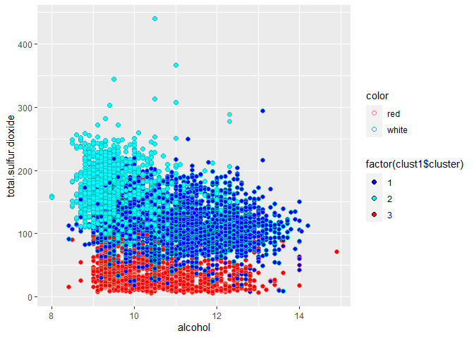

The figure above shows a scatter plot of alcohol percentage vs total
sulfur dioxide. These variables were chosen because the scatter plot
does a good job of visually separating the red and white wine clusters
in our data. K-means++ was run with k equal to three (three was chosen
based on maximizing a CH index across a grid of potential k). The color
of the points is determined based on resulting cluster. The outline of
each point is colored based on the actual color of the wine. We find
that one cluster generally identifies red wine and two clusters identify
white wines. And, while there are a few miscategorized wines, the
clusters appear to do an excellent job of distinguishing between red and
white wines.

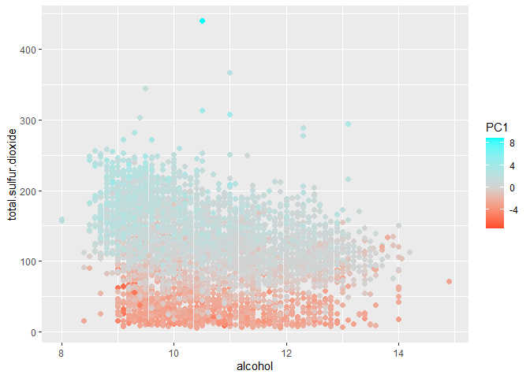

Touching back on PCA, the above scatter plot colored by PCA1 for the
same variables also appears to accurately pick up on the red vs white
wine distinction.

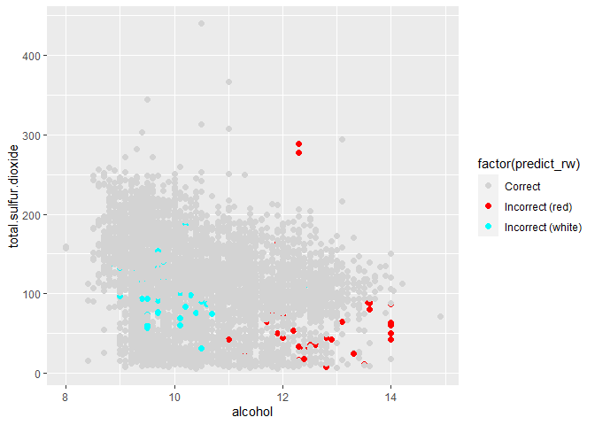

The above scatter plot colors only the wines that our K-means++
algorithm incorrectly categorizes wine color for. Here we can clearly
see that our clustering methodology is easily classifying most wines in
our data. White wines (of which there are approximately 4,900 in our
data) are classified correctly 98.9% of the time. And red wines (of
which there are approximately 1,600 in our data) are classified
correctly 96.2% of the time.

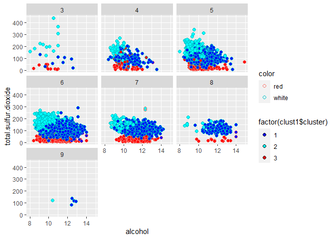

Faceting our original scatter plot by wine quality score allows us to
see our clusters across each level of quality. We do not find that the
clustering algorithm has naturally picked up on distinguishing between
wines of varying quality. In order to do this, it is likely we would
need to incorporate supervised learning techniques to allow for some
kind of determination of the chemical properties that lead to higher
quality scores.

## 2) Market Segmentation

Here we are interested in market segments within this social media
audience. First, we will seek to identify meaningful market segments by
analyzing correlated tweet interests. Then we will utilize K-means++
clustering to demonstrate that it is straightforward to identify
individuals as members of said market segments. Based on these results,
a discussion of the insights gleaned will follow (with a focus on what
actions NutrientH20 can consider to best position its brand with regard
to its Twitter audience). Note that of the 36 tweet categories, two
(“chatter and”uncategorized”) were excluded from the following analysis
due to the lack of meaningful information conveyed by those categories.

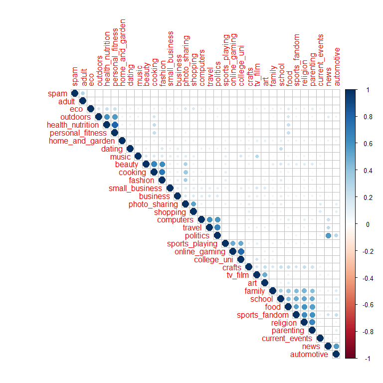

The correlation plot above has been reordered by clusters in order to
more easily identify groups of correlated interests. We find 5 clusters
of categories where there are at least three categories highly
correlated with each other. These include: (1) Health/Nutrition,
Personal Fitness and Outdoors; (2) Cooking, Beauty and Fashion; (3)
Politics, Travel and Computers (I would group News with these as well
given its noteworthy correlation with each of these categories); (4)
College/University, Online Gaming and Sports Playing; (5) Family,
Parenting, School, Religion and Sports Fandom. We will discuss each of
these categories in more detail later, but next we will use K-means++
clustering with k equal to 6 to see if we can adequately categorize
individual users into our market segments as specified. The following
matrix heat maps will show us which are the most active categories for
each of our determined clusters.

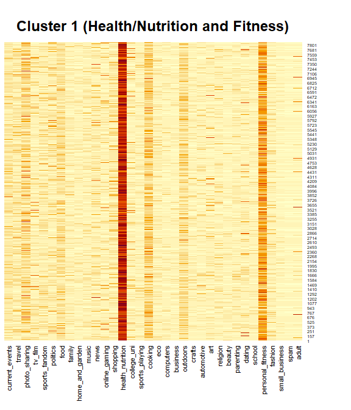

The above heat map finds that cluster 1 appears to have identified the
Health/Nutrition, Personal Fitness and Outdoors category. We note that
although “Outdoors” is also a highly correlated interest. The magnitude
of the number of Health/Nutrition and Personal Fitness posts is much
larger. In the remaining cluster heat maps to follow, we will see that a
catch-all other category picks up on a relatively large number of photo
sharing oriented twitter users, and that the remaining 4 market segments
are also identified utilizing this methodology.

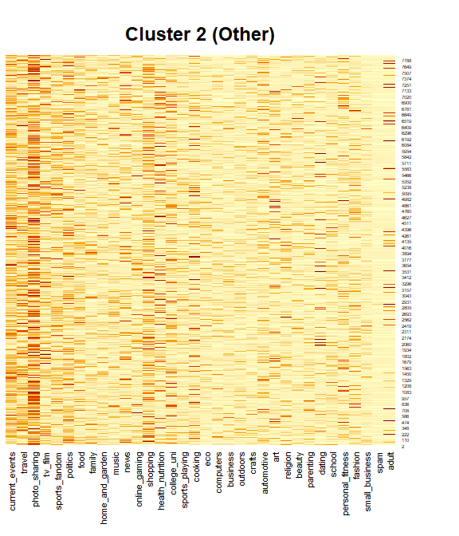

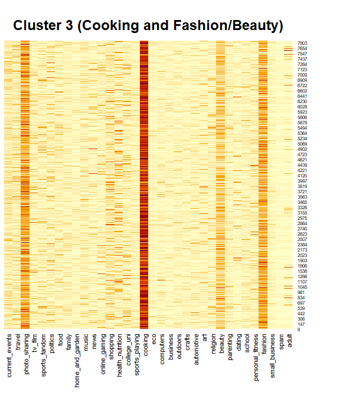

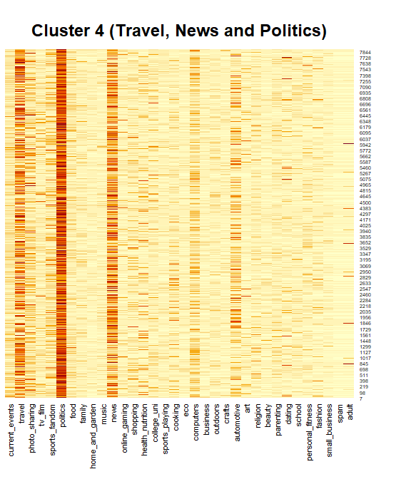

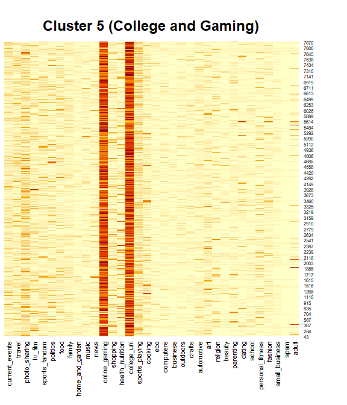

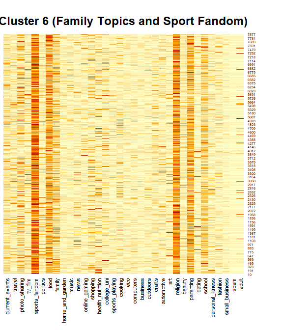

Based on the above analysis, we see that at least five easily
identifiable market segments exist within the Twitter audience of
NutrientH20 and that these segments can be relatively easily identified
with an unsupervised learning algorithm. Thus, each of these groups can
be targeted in distinct ways to increase brand engagement.

Regarding the Health/Nutrition, Personal Fitness and Outdoors segment,
we find that although “Outdoors” is a highly correlated category in this
group, Health/Nutrition and Fitness are the primary interests by volume
of posts. Thus, posts seeking to engage based on those subjects are
likely best for this particular market segment.

Regarding the Cooking, Beauty and Fashion segment, we note that photo
sharing is also a highly populated column in our cluster heat map.
Perhaps there is merit to the strategy of targeting this audience with
photo oriented posts given their high relative interest in aesthetics.

Regarding the Politics, Travel and Computers segment, these Twitter
users seem to be more in tune with news, travel and issues of interest
in the political sphere. Posts that have grounding in current events of
the world and political issues seem most likely to engage this market
segment.

Regarding the College/University, Online Gaming and Sports Playing
segment, we find that online gaming and College/University categories
seem to be far more populated in our heat map. A potential course to
engage this segment might be through endorsement deals with gamers or
through other online gaming content. College sports and relevant
endorsement content might be another way to engage this segment.

Finally, the family topics (“Family”, “Parenting”, “Religion”, “School”)
and Sports Fandom segment, provides an opportunity to engage with users
who are presumably the parents of family units. Thus, family or youth
sports oriented content could be an effective way to engage this group.
Additionally, this segment probably has the most to gain from leveraging
sports endorsement deals as engagement leverage given the high number of
tweets related to sports fandom (likely related to specific teams).
Determining which teams members of this market segment follow and post
about could be of additional interest when thinking about long term
engagment.

## 3) Association Rules for Grocery Purchases

In this exercise, we seek to use association rule mining to discover
interesting rules related to grocery shopping baskets. Additionally, we
will seek to select a subset of rules that can be visualized and sense
checked.

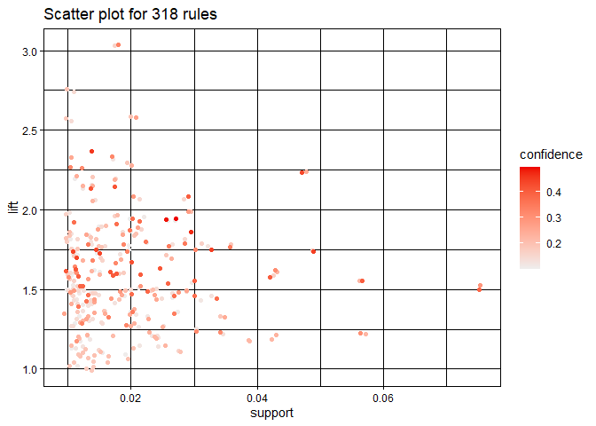

The figure above displays a scatter plot of associated rules plotted by
support and lift (and colored by confidence). Note that determined rules
with a lift of 1 were excluded from this plot (said rules have very high
confidence and disrupt the color scale while being relatively
uninteresting for our purposes). Based on this plot, our thresholds for
lift and confidence were chosen as 1.8 and 0.3, respectively. Limiting
our rules to those with confidence of at least 0.3 limits us to the top
half of our confidence level distribution. And limiting lift to 1.8
gives us enough rules to show an interesting graph while only including
those with relatively high lift.

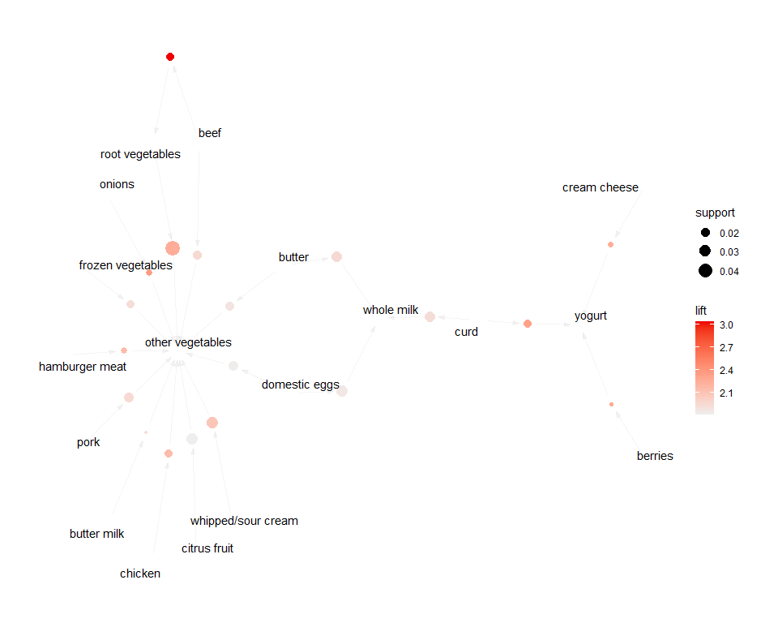

The resulting graph displays the rule relationships as determined above.
We find that “other vegetables” serve as a central element where many
items (such as hamburger meat, chicken, onions, etc.) indicate an
increased chance of including “other vegetables” in a shopping basket.
This makes sense because many of these items would seem to indicate that
an individual is planning to cook a full meal where the catch-all of
“other vegetables” would commonly capture something in the overarching
meal ingredients. The dairy side of our resulting graph is also of
interest. We see that berries, cream cheese or curd all provide lift for
yogurt also appearing in a basket. Note that by far our largest lift in
this graph belongs to the beef to root vegetables rule. This not only
makes sense but emphasizes that steak and potatoes remain a very strong
component of many red-blooded american diets.
