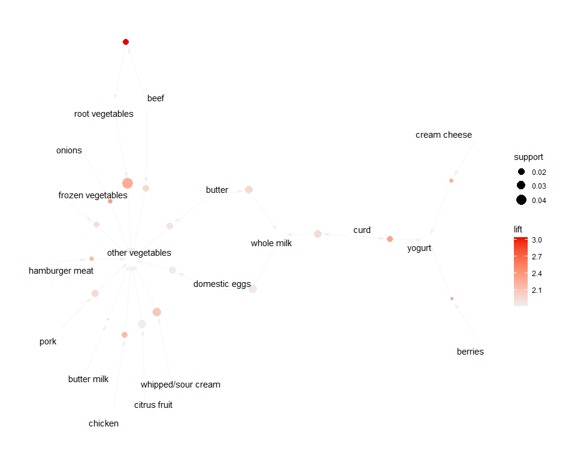

ECO 395 Homework 4: Taylor Neal
================

## 1) Clustering and PCA

Intro

|                      |   PC1 |   PC2 |   PC3 |   PC4 |   PC5 |
|:---------------------|------:|------:|------:|------:|------:|
| fixed.acidity        | -0.24 |  0.34 | -0.43 |  0.16 | -0.15 |
| volatile.acidity     | -0.38 |  0.12 |  0.31 |  0.21 |  0.15 |
| citric.acid          |  0.15 |  0.18 | -0.59 | -0.26 | -0.16 |
| residual.sugar       |  0.35 |  0.33 |  0.16 |  0.17 | -0.35 |
| chlorides            | -0.29 |  0.32 |  0.02 | -0.24 |  0.61 |
| free.sulfur.dioxide  |  0.43 |  0.07 |  0.13 | -0.36 |  0.22 |
| total.sulfur.dioxide |  0.49 |  0.09 |  0.11 | -0.21 |  0.16 |
| density              | -0.04 |  0.58 |  0.18 |  0.07 | -0.31 |
| pH                   | -0.22 | -0.16 |  0.46 | -0.41 | -0.45 |
| sulphates            | -0.29 |  0.19 | -0.07 | -0.64 | -0.14 |
| alcohol              | -0.11 | -0.47 | -0.26 | -0.11 | -0.19 |

TBU

TBU

TBU

TBU

TBU

## 2) Market Segmentation

TBU

TBU

TBU

Conclusion

## 3) Association Rules for Grocery Purchases

Intro

TBU

Conclusion
